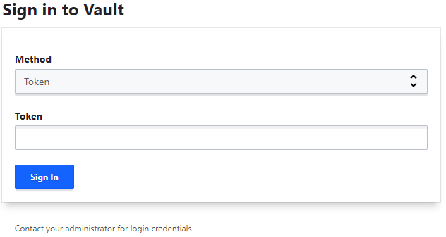

# UI - (User Interface)

A UI do Vault (Interface de Usuário) é uma interface gráfica que facilita a interação com o Vault, permitindo que você visualize, crie, edite e exclua secrets, gerencie tokens, explore a configuração do Vault e execute diversas operações de maneira mais acessível, sem a necessidade de usar a CLI.

## Acessando a UI do Vault

Por padrão, a UI do Vault é acessível via navegador na mesma URL do Vault, geralmente em http://127.0.0.1:8200 (se você estiver rodando o Vault localmente). Quando você habilita o Vault, ele ativa a UI automaticamente, desde que você tenha acesso ao Vault e esteja usando a versão do Vault que inclui a interface.

> No projeto para acessar o UI é com `http://localhost:8200/ui/`.

## Login na UI

Ao acessar o Vault pela primeira vez, você verá uma tela de login onde precisará fornecer um token de autenticação.

> Para esse caso usamos o token root por estar em modo desenvolvimento. O token é `myroot`.

## Principais Funcionalidades da UI do Vault

A UI do Vault fornece uma interface visual para diversas operações, tornando o gerenciamento de secrets mais simples. Aqui estão algumas das funcionalidades principais da UI:

1. Visão Geral do Status do Vault
Ao fazer login, você verá uma visão geral do status do Vault, incluindo informações como:
    * Se o Vault está selado ou não.
    * O status da inicialização.
    * O número de tokens ativos.

2. Gerenciamento de Secrets: A principal funcionalidade da UI é o gerenciamento de secrets. Você pode fazer as seguintes operações através da interface:

    * Visualizar Secrets: A UI permite navegar pelos caminhos de secrets e visualizar seus valores. Dependendo da política de segurança, você pode visualizar ou editar os dados.

        * Você pode acessar a seção "Secrets" no menu à esquerda e navegar até o caminho específico (por exemplo, secret/ para o engine de KV).

    * Criar e Editar Secrets: Você pode facilmente criar novas secrets e atualizar valores de secrets existentes, sem precisar usar a CLI. Isso é útil para armazenar chaves, senhas, configurações ou qualquer outro tipo de dado sensível.

        * Ao acessar o caminho desejado, você encontrará uma opção para adicionar ou editar o valor de uma secret.

    * Excluir Secrets: Você pode excluir secrets através da UI, clicando em um item e selecionando a opção de exclusão.

3. Gerenciamento de Tokens: A UI permite que você gerencie tokens de autenticação de forma visual. Você pode: 

    * Criar novos tokens: Através do painel de tokens, você pode criar tokens de autenticação com permissões específicas.
    
    * Visualizar e revogar tokens existentes: Você pode visualizar os tokens ativos, as permissões associadas a eles e revogar tokens quando necessário.

4. Gerenciamento de Políticas: Se você estiver configurando permissões no Vault, pode visualizar e gerenciar políticas diretamente da UI. Isso inclui: 

    * Criar novas políticas de acesso: Você pode adicionar novas regras de controle de acesso que determinam quem pode acessar o quê no Vault.

    * Editar políticas existentes: Se você já tiver políticas configuradas, pode editá-las diretamente na UI.

5. Visão de Logs e Auditoria: O Vault também pode registrar logs de auditoria. A UI permite visualizar esses logs, o que pode ser útil para fins de segurança e auditoria.

6. Gerenciar Secrets Engines: 
Na UI, você pode configurar e habilitar diferentes engines de secrets, como: 
    * KV (Key-Value): Para armazenar pares chave-valor.

    * Pki (Public Key Infrastructure): Para gerenciar certificados SSL/TLS.

    * AWS, Azure, etc.: Para gerar credenciais temporárias de cloud.

## Segurança e Permissões na UI

As permissões de acesso à UI do Vault são controladas pelas políticas associadas aos tokens que você usa para fazer login. Os administradores do Vault podem definir regras detalhadas sobre o que os usuários podem acessar ou modificar através da UI.

* Políticas de acesso: Podem ser configuradas para restringir o acesso a certas seções, como quem pode visualizar ou editar secrets, criar novos tokens, ou acessar logs de auditoria.

